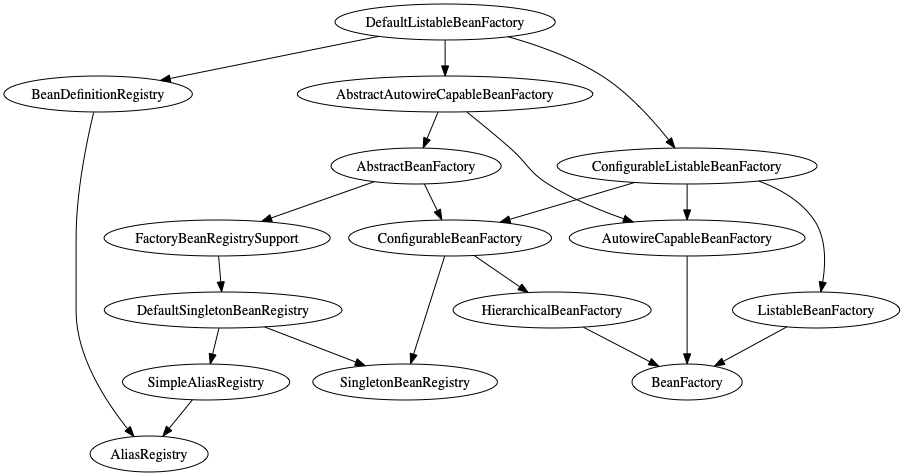

# Java Class Relation

> 基于《自己动手写虚拟机》代码

## 最初定位

实现对Java代码的分析，在改动一个方法时，能准备知道它的影响范围 

## 预期功能

基于字节码分析实现：
1. 分析类间的继承关系（图）
2. 分析包之间的调用关系（图）
3. 分析类之间的调用关系（图）
4. 分析方法之间的调用关系（图）

## 目前实现
查看指定类的所有父类及关系，目前通过扫描spring的包查找的`DefaultListableBeanFactory`父类关系如图：

(现在没有找到合适的输出方式，目前是使用graphviz【需要自行安装】，生成dot文件后，手动执行`dot -Tpng classRelation.dot -o classRelation.png`生成最终的图)

**欢迎有兴趣的同学RP**